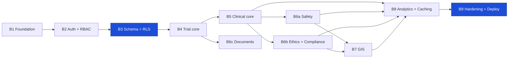

# SIH26046 — Backend Implementation Phases (Spring Boot)

> Implements [docs/superpowers/specs/2026-09-01-spring-boot-backend-design.md](docs/superpowers/specs/2026-09-01-spring-boot-backend-design.md).
> Domain rules come from [PROJECT_ARCHITECTURE.md](PROJECT_ARCHITECTURE.md) §5–§23; where the two disagree, the design spec's §14 deviation table wins.
> Nine phases. Every phase ends with something running and testable against the API.

| Field | Value |
|---|---|
| Stack | Java 26 · Spring Boot 4.1 · Hibernate · Flyway · PostGIS · Caffeine · Bucket4j |
| Deploy | Oracle Always Free VM (app + Redis + ClamAV) · Supabase Postgres · Vercel frontend |
| Scope | `backend/` only |
| Parallelisable | B6 splits into three independent tracks |

---

## Phase map

Two orderings are load-bearing. **RLS lands in B3, not B9** — policies retrofitted onto
queries that assumed unrestricted access have to be re-tested one by one, and the team spends
six phases building habits RLS then breaks. **Caching lands in B8, after the queries it
caches have stopped changing shape** — B8 opens by profiling, and the first answer to a slow
endpoint is an index or a materialized view, never a cache entry.

---

## B1 · Foundation

**Goal** — `docker compose up` gives a healthy Spring Boot app on Postgres+PostGIS and Redis, and CI produces both a jar and a native binary.

| Item | Detail |
|---|---|
| Build | Gradle multi-module, toolchain `languageVersion = 26`; the eleven modules from spec §8; wrapper committed so no local Gradle is needed |
| App | `ctms-app` boot entrypoint, `application.yml` profiles (`local`, `oracle`), config binding for every spec §5 setting |
| Concurrency | `spring.threads.virtual.enabled=true` — the §5.1 decision, set once, here |
| Compose | postgres+postgis, redis, clamav, prometheus, grafana for local dev |
| Migrations | Flyway wired, `V1__baseline.sql` empty, PostGIS extension enabled |
| Endpoints | Actuator `/health/liveness`, `/health/readiness` |
| CI | `./gradlew build`, `gitleaks`, Flyway migrate-from-empty via the acceptance test |
| Infra | Oracle Always Free VM provisioned; ARM capacity confirmed in-region (spec §15.4) |

**Done when** — readiness returns 200 in CI and Flyway migrates cleanly from empty.

> **No native image.** GraalVM publishes no Java 26 build (Oracle serves 24 and 25; Community's newest is 25), so "latest Java" and "native image" are mutually exclusive today. The deployable is the fat jar — on a 24 GB always-on VM, native's heap and cold-start wins do not apply.

---

## B2 · Auth + RBAC

**Goal** — a user can log in, and any handler can be gated by permission.

| Item | Detail |
|---|---|
| Tables | `users`, `roles`, `permissions`, `role_permissions`, `sessions` (§8.2–8.6) |
| Module | `ctms-security` — Spring Security 6 filter chain, JWT encode/decode, Argon2id `PasswordEncoder` |
| Authorities | Permissions resolved to `GrantedAuthority`; `@PreAuthorize("hasAuthority('trial:read')")` at class level, narrowed per method for mutations (§6.5) |
| Tokens | 15-min access JWT, rotating refresh with reuse detection (§18.2, §18.6); cookies `HttpOnly; Secure; SameSite=Lax` (§18.3, preserved by the Vercel proxy) |
| Sessions | Refresh families stored in **Postgres**, not Redis — spec §9.1 |
| Endpoints | `POST /auth/login` `/auth/refresh` `/auth/logout`, `GET /auth/me`; read routes for `/users` `/roles` `/permissions` |
| Seed | 7 roles + the full §6.3 catalogue as a **Flyway** migration, reviewable as a diff (§6.6) |

**Done when** — a handler annotated `hasAuthority('trial:read')` returns 403 for a role lacking it and 200 for one holding it; replaying a used refresh token revokes the whole family.

> No role name appears in any `@PreAuthorize` expression. An ArchUnit rule enforces it (§6.1).

---

## B3 · Schema + RLS  🔒

**Goal** — all 23 tables exist, and the database itself refuses out-of-scope rows.

| Item | Detail |
|---|---|
| Tables | The remaining 18 from §8 with every CHECK, FK and unique constraint (§14.2) |
| Partitioning | `observations` and `audit_logs` range-partitioned by month; index `(participant_id, recorded_at)` (spec §7) |
| Indexes | The §28.2 set, plus GiST on every `geography` column |
| RLS | `ENABLE` + `FORCE ROW LEVEL SECURITY`, policies per table class (§7.5), helpers `SECURITY DEFINER` to avoid the §7.4 recursion trap |
| **Identity propagation** | One `TransactionSynchronization` in `ctms-security` issuing `SELECT set_config('app.current_user_id', :uid, true)` — parameterised (§7.3), transaction-scoped, pooler-safe (spec §6.2) |
| Roles | Resolve the `BYPASSRLS` question (spec §6.3): explicit permissive policies or `SECURITY DEFINER` functions, since Supabase grants no superuser |
| Pooling | Supavisor transaction mode; `prepareThreshold=0`, Hibernate statement cache off |
| Audit | `audit_logs` immutability trigger + revoked UPDATE/DELETE grants (§7.8, §19.4) |
| Job queue | `jobs` table, `SELECT … FOR UPDATE SKIP LOCKED` poller on a virtual-thread executor, retry with backoff and a dead-letter state (spec §10) |

**Done when** — the scope harness (B3 deliverable, see below) is green; `UPDATE audit_logs` fails at the database; and the 200-connection interleaved-borrow test shows no residual GUC.

> **Build the scope harness here.** A parameterised test replaying every repository query as each of the seven roles against an expected visibility matrix. From B4 onward, a new RLS-scoped table that doesn't register with it fails the build.

---

## B4 · Trial core

**Goal** — the scope table exists, so everything after this can be scoped.

| Item | Detail |
|---|---|
| Module | `ctms-trials` |
| Endpoints | `/institutions` `/trials` `/sites` `/trial-staff` — full CRUD on §21.1 conventions |
| Geography | `institutions.location`, `trial_sites.location` as `geography(Point,4326)`; Hibernate Spatial + JTS mapping |
| Concurrency | `ETag` on reads, `If-Match` required on updates (§14.4) |
| Lifecycle | Trial state machine `DRAFT → ACTIVE → COMPLETED → ARCHIVED` (§20.2) |
| Layering | `controller → service → repository` established here as the pattern every later module copies |

**Done when** — `trial_staff` assignments visibly change what `GET /trials` returns, with no scope filtering written in the query.

---

## B5 · Clinical core

**Goal** — pseudonymised enrolment and the clinical record.

| Item | Detail |
|---|---|
| Module | `ctms-clinical` |
| Enrolment | `EnrollmentService` — the five-table atomic enrolment of §14.6 in one local `@Transactional` |
| Isolation | `participant_identities` reachable only via `participant_identity:*`, never joined into clinical responses (ADR-011); every read audited (§19.3) |
| Endpoints | `/participants` `/consents` `/visits` `/observations` `/medications` |
| Rules | No consent, no clinical write; withdrawal stops new data without deleting old (§20.3) |
| Idempotency | `Idempotency-Key` on enrolment, keys in Redis (§14.5) |

**Done when** — a replayed enrolment request creates exactly one participant, and no clinical response body contains an identifying field.

---

## B6 · Three parallel tracks

Independent of one another; one per team member.

### B6a · Safety — `ctms-safety`
`/adverse-events` `/safety`. AE capture with severity and causality, SAE escalation, review workflow, and the event-triggered clinical read letting a Safety Officer cross site scope on an AE they are reviewing (§7.5) — audited on every use (§19.3).

### B6b · Ethics + Compliance — `ctms-ethics`
`/ethics` `/compliance`. Submission → review → decision, scoped to the reviewer's institution; `compliance_requirements` definitions and per-trial status rollup.

### B6c · Documents — `ctms-documents`
`/documents`. Signed Cloudinary upload, MIME + magic-byte + size validation (§16.5), **ClamAV scan dispatched to the B3 job queue**, `QUARANTINED` until CLEAN, immutable version chain on supersede (§17.2), short-lived signed download URLs (§16.4), orphan sweep job (§16.7).

**Done when** — each track's endpoints pass their API tests and register with the scope harness; an infected upload never reaches `AVAILABLE`.

---

## B7 · GIS

**Goal** — one map API, seven answers, no re-identification.

| Item | Detail |
|---|---|
| Module | `ctms-gis` |
| Endpoints | `/gis/*` per §10.5, GeoJSON responses |
| Aggregation | Country → state → district → site, aggregated **in PostGIS** via native SQL or jOOQ, never in Java (§10.3) |
| Privacy | k-anonymity suppression below threshold; suppressed cells return a marker, not a count (§11.4) |
| Gating | `gis:read` for every role; `gis:drilldown` gates site detail, then RLS narrows again (§11.3) |

**Done when** — a Regulatory Officer request returns aggregates with small cells suppressed, and a test proves no sequence of overlapping bounding boxes reconstructs a suppressed count.

---

## B8 · Analytics + Caching

**Goal** — dashboards are fed, then made fast. In that order.

| Item | Detail |
|---|---|
| Module | `ctms-analytics` |
| Endpoints | `/analytics/dashboard` — one endpoint, seven role-shaped payloads (§21.4, §23); `/audit` read-only |
| **Read model** | Dashboard rollups and GIS aggregates become **materialized views**, refreshed `CONCURRENTLY` by the job queue. Dashboards never touch base tables (spec §7) |
| Profile first | Measure before caching: index → materialized view → *then* cache. Never cache to hide a bad plan (§28.1) |
| Cache | **Caffeine L1** behind a `CacheProvider` interface; Redis L2 wired but inactive at one instance (spec §9.1) |
| Invalidation | The §13.2 write→key map, applied identically to both tiers, wired in services not controllers |
| Never cached | Clinical rows, identities, per-record permission decisions (§12.2) |

**Done when** — dashboard p99 is recorded against the seeded dataset, and a write to any source table demonstrably invalidates its dependent keys and marks its view stale.

---

## B9 · Hardening + Deploy

**Goal** — the security suite is green and the stack runs on the real VM.

| Item | Detail |
|---|---|
| Filters | Request ID → MDC, rate limiting, CSRF double-submit (§18.12), security headers (§18.15), error handler that leaks nothing (§18.17) |
| Rate limits | **Bucket4j in-memory** (spec §9.2), tiered by threat: strict on `/auth/*`, on `participant_identity:read`, and on `gis:drilldown`; generous on ordinary reads |
| Audit | Every §19.2 event covered including the three audited reads (§19.3); PHI redaction in `old_values`/`new_values` (§19.5) |
| Security tests | The full §27.4 suite — authorization matrix, RLS bypass attempts, upload abuse, rate limiting, CSRF, plus the GUC leak test |
| Deploy | Compose on the Oracle VM (fat jar + Redis + ClamAV + Prometheus + Grafana); Caddy TLS; Vercel rewrite proxying `/api/*` (spec §6.4) |
| Keep-alives | Scheduled Supabase query (7-day pause) and health ping — both are deliverables, not afterthoughts |
| Backups | Self-managed `pg_dump` to object storage; free Supabase has none. **Run a restore drill** |
| Load proof | k6 against a locally seeded 50–100M observation dataset: p50/p95/p99 and RPS per endpoint class, plus the saturation point *and its cause*. Grafana captures into the README |

**Done when** — the security suite passes in CI, a restore has actually been performed, the deployed application serves the Vercel frontend end to end, and the load numbers are published.

---

## Free-tier realities to design around

| Constraint | Consequence |
|---|---|
| Supabase 500 MB, no backups, no replicas | Deployed dataset ~500 trials / 5k participants / ~1M observations; benchmark locally at 50–100M (spec §7.1) |
| Supabase pauses at 7 days idle | Scheduled keep-alive query, B9 |
| Upstash 500k commands/month | Why Redis is co-located on the VM and Caffeine is L1 (spec §4, §9) |
| No free managed Kafka | Postgres job queue instead (spec §10) |
| Vercel and backend are different sites | Rewrite proxy keeps cookies `SameSite=Lax` (spec §6.4) |
| No BAA on free Supabase | Synthetic data only; state it in the README |

---

## Working rules for every phase

| Rule | Detail |
|---|---|
| Migrations | Schema, RLS policies, grants and seed data are all Flyway migrations; applied versions are never edited |
| Tests with the PR | An endpoint PR ships its API test, and any RLS-scoped table registers with the scope harness |
| Thin controllers | No business logic or SQL in controllers; transactions open in services |
| No role names in code | Gate on permissions only, enforced by ArchUnit (§6.1) |
| Definition of done | Merged · tests green · migration applied cleanly · in OpenAPI · permission in the catalogue |
