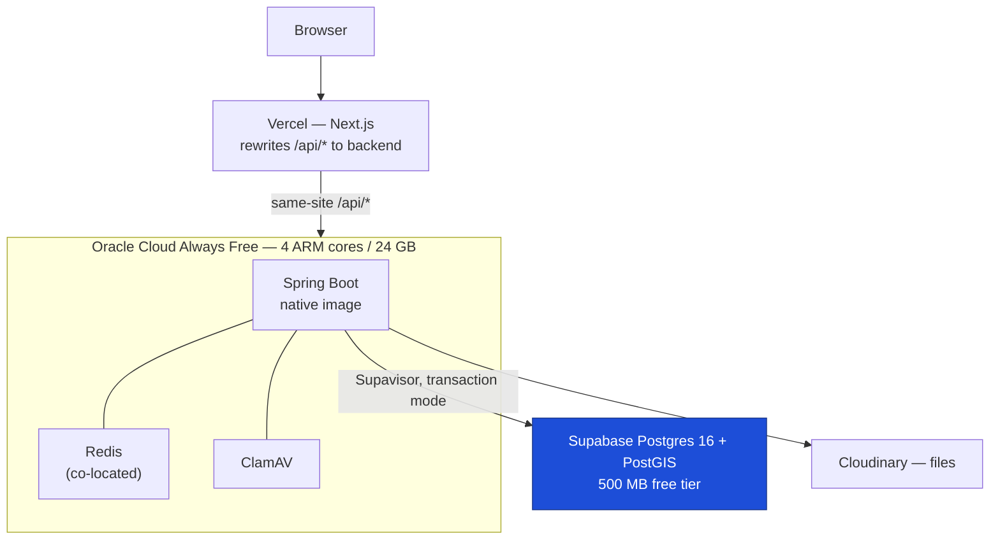

# SIH26046 Backend — Spring Boot Design

> **Status:** design, approved in brainstorming 2026-09-01
> **Supersedes:** the FastAPI-specific parts of [PROJECT_ARCHITECTURE.md](../../../PROJECT_ARCHITECTURE.md) (§3.2, §24 backend tree, §26, §29)
> **Retains:** the domain, security and data model of that document unchanged — §5–§23 remain authoritative

---

## 1. Why this document exists

PROJECT_ARCHITECTURE.md v1.0 specifies a FastAPI backend. This document re-specifies the
backend on Java + Spring Boot, adds an explicit scale model, and adapts the deployment to
free-tier managed services. **The domain model, RBAC catalogue, RLS policy design, GIS
privacy rules and audit requirements are unchanged** — this is a change of implementation
technology and deployment target, not of architecture intent.

Every deviation from the parent document is listed in §14. Nothing deviates silently.

---

## 2. Goals and non-goals

**Goals**

1. Implement the §5–§23 domain on Spring Boot with equivalent security guarantees.
2. Preserve two-layer authorization: RBAC in the application, RLS in PostgreSQL (ADR-003).
3. Run entirely on free-tier infrastructure without pretending the free tier is production.
4. Be honest about scale: design for the axis that is actually large (rows), not the one
   that sounds impressive (users).
5. Produce measured performance numbers, not adjectives.

**Non-goals**

- Microservices. A modular monolith is correct at this concurrency (§3).
- Reactive/WebFlux. See §5.1.
- Real PHI. Free-tier Supabase offers no BAA and no backups; this deployment carries
  synthetic data only, stated plainly in the README.
- Anything in §32.1 of the parent document that was already out of scope.

---

## 3. Scale model

The parent brief cited "1 million users". Analysis during design showed that number
describes the wrong axis, and the design targets the corrected one.

### 3.1 Users are staff, not participants

All seven roles in §5 are staff roles. Participants are pseudonymised records with no
login (ADR-011). So the user population is clinical research staff.

| Quantity | Estimate | Basis |
|---|---|---|
| Trials, all time | ~95,000 | CTRI registered total |
| Staff per trial | 5–20 | PI, coordinator, research staff, safety, ethics |
| **Distinct staff accounts** | **50k–150k** | Heavy cross-trial overlap |
| Peak concurrent sessions | 10k–15k | Working-hours fraction |
| **Concurrent in-flight requests** | **~100–1,000** | 200 ms responses, ~30 s think time |

A national platform covering all Indian clinical research tops out two to three orders of
magnitude below 1M users. One tuned instance on virtual threads absorbs 1,000 concurrent
requests.

### 3.2 Rows are the large axis

| Entity | Estimate | Basis |
|---|---|---|
| Participants | 20–25M | 95k trials × ~250 |
| Visits | ~250M | ~12 protocol visits each |
| **Observations** | **5–9 billion** | ~30 measured fields per visit |
| Documents, consents, AEs | 50–100M | — |

**The system is therefore low-concurrency, billion-row, aggregate-read-heavy.** This
inverts the usual priority list, as §7 and §8 reflect.

### 3.3 Target operating points

| Profile | Definition |
|---|---|
| **Steady state** | 1,000 concurrent staff, seeded large dataset, p99 < 200 ms on dashboards and GIS |
| **Breaking point** | Ramp until saturation; report *what* saturated and why |

The public claim is *"national-scale registry: 24M participant records, 5B clinical
observations, sub-200 ms dashboards, row-level access control enforced in the database"* —
not a user count.

---

## 4. Deployment topology



| Component | Host | Free-tier limit that matters |
|---|---|---|
| Frontend | Vercel Hobby | Non-commercial use |
| Backend, Redis, ClamAV | Oracle Always Free VM | ARM capacity availability by region |
| Database | Supabase | 500 MB, no replicas, no backups, pauses at 7 days idle |
| Files | Cloudinary | Free tier quota |

**Redis is co-located on the Oracle VM**, not Upstash. Upstash free allows 500,000 commands
per month — about 11/minute — which a per-request cache exhausts in minutes, and its
cross-internet round trip (~30 ms) exceeds the queries it would cache. An Upstash profile is
retained in configuration as a managed fallback.

**Two scheduled keep-alives** are required and are part of the deliverable: a Supabase query
(the project pauses after 7 days idle) and a health ping.

---

## 5. Technology stack

| Concern | Choice | Note |
|---|---|---|
| Language / runtime | **Java 26** | Latest release; non-LTS, EOL ~Mar 2027. Gradle toolchain — one line to move to 25 LTS |
| Framework | **Spring Boot 4.1.x** | First line supporting Java 26; Spring Framework 7 |
| Concurrency | **Spring MVC on virtual threads** | See §5.1 |
| ORM | Spring Data JPA / Hibernate | Plus **jOOQ or native SQL** for GIS and analytics |
| Migrations | **Flyway** | SQL-first: RLS policies and grants *are* raw SQL |
| Validation | Jakarta Bean Validation | On Java `record` DTOs |
| Security | Spring Security 6 | Permissions as `GrantedAuthority` |
| Cache | **Caffeine (L1)** + Redis (L2) | §9 |
| Rate limiting | **Bucket4j, in-memory** | §9.2 |
| Async jobs | **Postgres queue + `@Scheduled`** | §10 — no Kafka on free tier |
| API docs | springdoc-openapi | Generates the frontend's typed client |
| Tests | JUnit 5, Testcontainers, RestAssured | §13 |
| Load | k6 | §13.3 |
| Packaging | **GraalVM native image** via Spring AOT | JVM for local dev, native in CI (§5.2) |

### 5.1 Virtual threads, not WebFlux

Reactive Spring requires R2DBC, which gives up Hibernate and makes transaction-scoped RLS
context (§6.2) substantially harder. Project Loom delivers equivalent concurrency with
blocking JDBC and ordinary `@Transactional`. WebFlux here would trade the security model
for throughput that virtual threads provide free.

### 5.2 Native image policy

Local development runs the plain JVM for iteration speed. CI produces both a fat jar and a
GraalVM native image; the native image is what deploys. Code stays AOT-clean throughout —
no runtime reflection without a registered hint — so the native build never diverges from
what was developed. Hibernate and Spring Data AOT hints are maintained as a first-class
part of the build, not a phase-9 scramble.

---

## 6. Security architecture

### 6.1 RBAC — unchanged semantics, Spring mechanism

The §6.3 permission catalogue is unchanged. Permissions become `GrantedAuthority` values
resolved once per request from the user's role:

```java
@PreAuthorize("hasAuthority('participant:create')")
```

Applied at class level for the module's read permission and narrowed at method level for
mutations — preserving §6.5's property that a forgotten annotation fails *closed*.
**Role names never appear in an expression** (§6.1).

### 6.2 RLS under a connection pool — the critical mechanism

RLS needs `app.current_user_id` set per transaction. Two naive ports both fail:
`SET LOCAL` accepts no bind parameters, inviting the string concatenation §7.3 forbids;
plain `SET` persists on a pooled connection and leaks one user's identity to the next
borrower.

The mechanism used instead:

```java
// registered centrally on transaction begin — never called from a service by hand
em.createNativeQuery("SELECT set_config('app.current_user_id', :uid, true)")
  .setParameter("uid", userId.toString())
  .getSingleResult();
```

- **Parameterised** — satisfies §7.3.
- **`is_local = true`** — scoped to the transaction, dies at commit or rollback. Nothing
  to reset, nothing to leak.
- **Compatible with Supavisor transaction pooling**, because the GUC lifetime and the
  pooling unit are now the same boundary. Requires `prepareThreshold=0`; transaction
  pooling and server-side prepared statements do not mix.

Applied by one `TransactionSynchronization` registered in `ctms-security`. A mandatory test
borrows 200 connections across interleaved users and asserts no residual GUC on any of them.

### 6.3 The `BYPASSRLS` problem

§7.7 specifies a `ctms_worker` role with `BYPASSRLS`. Supabase grants no superuser, so this
attribute is likely not grantable. Resolution: **drop `BYPASSRLS`**; give the worker
identity explicit permissive policies, or route privileged access through `SECURITY DEFINER`
functions with an auditable, enumerable surface. This is stricter than a blanket bypass and
therefore an improvement, not a concession. To be verified against the live project in B3.

### 6.4 Cookies and CSRF

Vercel rewrites `/api/*` to the backend, so the browser sees a single origin. Consequently:

- Cookies remain `SameSite=Lax` as §18.3 specifies — no downgrade to `SameSite=None`.
- CSRF double-submit (§18.12) stays defence-in-depth rather than the sole control.
- CORS configuration is unnecessary, removing an entire class of misconfiguration.

---

## 7. Data layer

Priorities follow §3.2: at ~10⁹ rows and ~10³ concurrency, query plans and precomputation
matter; app-tier scale-out does not.

| Mechanism | Design |
|---|---|
| **Partitioning** | `observations` and `audit_logs` range-partitioned by month. Index `(participant_id, recorded_at)` serves per-participant lookups; time-bounded trial aggregates prune partitions. Without this a dashboard query scans the whole table |
| **Materialized views** | Dashboard rollups (§23) and GIS aggregates (§10.3) are the read model, not an optimisation. Refreshed `CONCURRENTLY` by the job runner. Dashboards never touch base tables |
| **Indexes** | The §28.2 set, plus GiST on every `geography` column |
| **Replicas** | Not available on free Supabase. `AbstractRoutingDataSource` seam is built and wired to a single datasource, so enabling replicas later is configuration |
| **Read-after-write** | Not needed at one datasource; the pin-to-primary rule is documented for when replicas arrive (§14.3, §15.3) |

### 7.1 Seed sizing under 500 MB

| Environment | Dataset |
|---|---|
| Free-tier deployment | ~500 trials, ~5k participants, ~1M observations, indexes included |
| Local / benchmark | 50–100M observations in Docker for load proof (§13.3) |

Where it runs and what it can do are proven separately, and stated that way.

---

## 8. Module structure

Gradle multi-module — the compiler enforces boundaries a Python package can only suggest.

```
ctms-common       errors, request-id, base entities, audit writer
ctms-security     JWT, Spring Security, RBAC, the RLS TransactionSynchronization
ctms-persistence  datasource routing, Flyway, base repositories
ctms-trials       institutions, trials, sites, trial_staff
ctms-clinical     participants, identities, consent, visits, observations, medications
ctms-safety       adverse events, safety reviews
ctms-ethics       ethics submissions, reviews, compliance
ctms-documents    Cloudinary, ClamAV, version chain
ctms-gis          PostGIS aggregation, k-anonymity
ctms-analytics    dashboards, rollups
ctms-app          boot entrypoint and composition — the only module aware of all others
```

One deployable. The five-table atomic enrolment (§14.6) stays a single local
`@Transactional` — precisely what a microservices split would have cost.

---

## 9. Caching and rate limiting

### 9.1 Two-tier cache

| Concern | Implementation | Rationale |
|---|---|---|
| Domain cache | **Caffeine L1**, Redis L2 | At one instance L1 serves everything at zero network cost |
| Permission sets | Caffeine, 5 min TTL | Replaces the §6.5 Redis lookaside; same invalidation-on-write rule |
| Sessions / refresh families | **Postgres `sessions`** | §8.6 already specifies this table |
| Idempotency keys | Redis | Genuinely needs to outlive a process |

Behind a `CacheProvider` interface. L2 activates on horizontal scale; the §13.2 invalidation
map applies to both tiers identically. §12.2's never-cached list is unchanged — clinical
rows, identities, and per-record permission decisions are never cached at either tier.

### 9.2 Rate limiting

Bucket4j **in-memory**. At one instance a per-instance limit *is* the global limit, and a
Redis-backed bucket would spend a network round trip per request to reach the same answer.
The `RateLimiter` interface has a Redis implementation for multi-instance deployment.

Its purpose here is abuse, not capacity. Tiers accordingly:

| Class | Limit posture | Threat |
|---|---|---|
| `/auth/*` | Strict | Credential stuffing (§18.10) |
| `participant_identity:read` | Strict | Mass re-identification (§8.12) |
| `gis:drilldown` | Strict | **Differencing overlapping bounding boxes to defeat k-anonymity suppression (§11.4)** |
| Ordinary reads | Generous | Not the constraint at 10³ concurrency |

The GIS drill-down limit is a genuine attack surface on this system specifically: repeated
overlapping aggregate queries can reconstruct a suppressed small cell.

---

## 10. Asynchronous work

No free managed Kafka exists. Replaced by a Postgres-backed queue:

- A `jobs` table drained with `SELECT … FOR UPDATE SKIP LOCKED`.
- A Spring `@Scheduled` poller on a virtual-thread executor, in-process for now, extractable
  to a separate deployable without changing producers.
- Retries with exponential backoff and a dead-letter state.

Jobs: ClamAV scanning, materialized view refresh, Cloudinary orphan sweep (§16.7),
notification fan-out, keep-alive pings.

**Audit writes stay synchronous and in-transaction.** §19.4 makes them part of the
durability guarantee; they must not become a message that can be dropped.

---

## 11. Documents

Unchanged from §16–§17: signed Cloudinary upload, MIME plus magic-byte plus size validation,
`QUARANTINED` until scan returns CLEAN, immutable version chain, short-lived signed download
URLs, orphan sweep.

ClamAV runs as a container on the Oracle VM — 24 GB accommodates the signature database
comfortably. The `MalwareScanner` interface retains a hosted-API implementation for
constrained hosts.

---

## 12. Observability

| Concern | Implementation |
|---|---|
| Logging | Structured JSON via Logback (§30.1); clinical values never logged (§30.7) |
| Correlation | `X-Request-Id` filter into MDC, echoed in every error body (§18.17, §30.3) |
| Metrics | Micrometer → Prometheus → Grafana, co-located on the VM |
| Errors | Sentry free tier |
| Health | Spring Actuator `/health/liveness`, `/health/readiness` (§29.7) |

Grafana dashboards double as the load-test evidence in §13.3.

---

## 13. Testing

### 13.1 Correctness
JUnit 5 with **Testcontainers** — PostGIS-enabled Postgres, Redis, ClamAV. Integration tests
run against the real database because RLS cannot be tested against a mock.

### 13.2 The scope harness
A parameterised harness replays every repository query as each of the seven roles and
asserts row visibility against an expected matrix. Any new RLS-scoped table registers with
it; a table that does not appear in the harness fails the build. This is the mechanical
equivalent of §26.4's "tests with features" rule.

Plus the §27.4 security suite: authorization matrix, RLS bypass attempts, upload abuse,
rate limiting, CSRF, and the 200-connection GUC leak test from §6.2.

### 13.3 Load proof
k6 against a locally seeded 50–100M observation dataset in Docker. Recorded per endpoint
class: p50/p95/p99, RPS, and the saturation point with its cause. Published in the README
with Grafana captures.

---

## 14. Deviations from PROJECT_ARCHITECTURE.md

| § | Parent document | This design | Why |
|---|---|---|---|
| 3.2 | FastAPI / Python | Spring Boot 4.1 / Java 26 | Requested |
| 3.5 | Celery | Postgres queue + `@Scheduled` | No free managed broker |
| 3.5 | — | Kafka dropped entirely | Same |
| 7.7 | `ctms_worker` has `BYPASSRLS` | Explicit policies or `SECURITY DEFINER` | Supabase grants no superuser (§6.3) |
| 12 | Redis as primary cache | Caffeine L1, Redis L2 | Free-tier command budget; one instance |
| 15 | Read replicas on the production path | Seam built, single datasource | Not on free Supabase |
| 18.3 | `SameSite=Lax` | Unchanged — **preserved via Vercel proxy** | Would have broken cross-site (§6.4) |
| 26 | 13 full-stack phases | Backend phases, re-scoped | Backend-only plan |
| 29 | Docker Compose on one VM | Compose on Oracle Always Free + Supabase | Free tier |
| 29.6 | Nightly `pg_dump` + restore drill | Self-managed dump to object storage | Supabase free has no backups |

**Unchanged and non-negotiable:** the §8 schema, the §6.3 permission catalogue, RLS as a
second enforcement layer (ADR-003), GIS k-anonymity (§11.4), audit immutability (§19.4),
and participant pseudonymisation (ADR-011).

---

## 15. Open items to verify during implementation

1. Whether Supabase permits creating roles with the attributes §6.3 needs — determines the
   final shape of the worker identity.
2. Supavisor transaction-mode behaviour with Hibernate's statement cache disabled; measure
   the cost.
3. GraalVM native image with Hibernate + PostGIS types — the JTS/geometry mapping is the
   likeliest source of missing AOT hints.
4. Oracle ARM capacity in the target region; if unavailable, fall back to Koyeb, at which
   point the native image stops being optional and Redis moves to Upstash.
5. Actual row sizing against the 500 MB ceiling once indexes and partitions exist.

---

## 16. Next step

Implementation phases are re-derived for this stack in
[BACKEND_PHASES.md](../../../BACKEND_PHASES.md), which this design supersedes in its
current FastAPI form.
